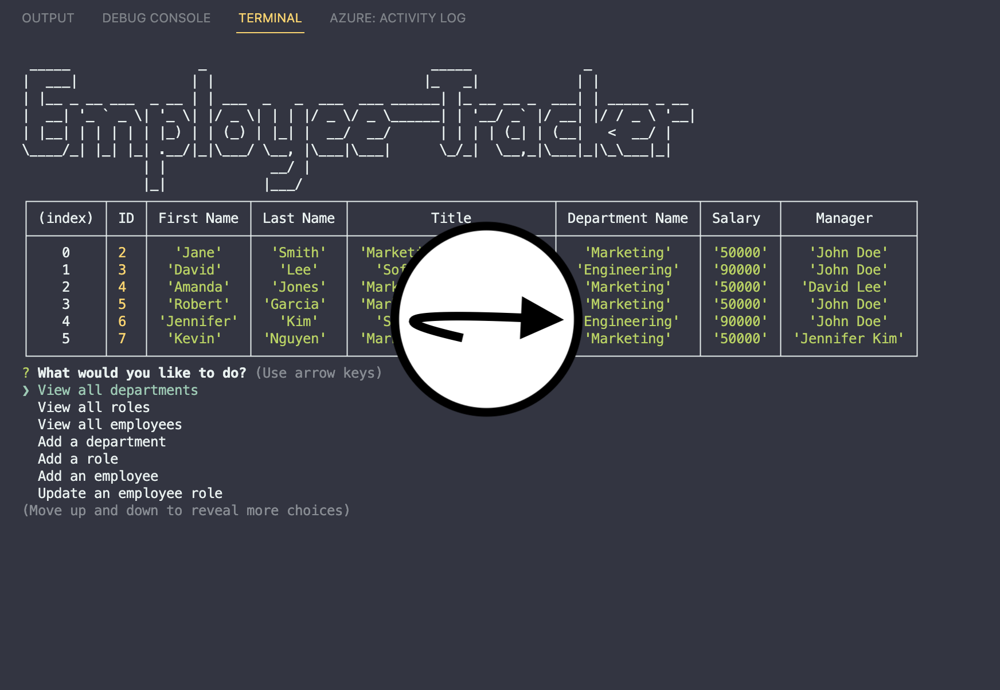
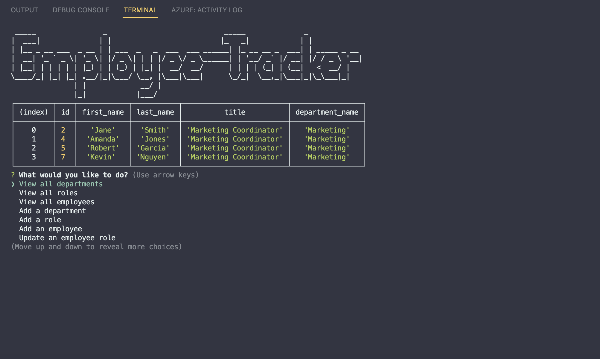
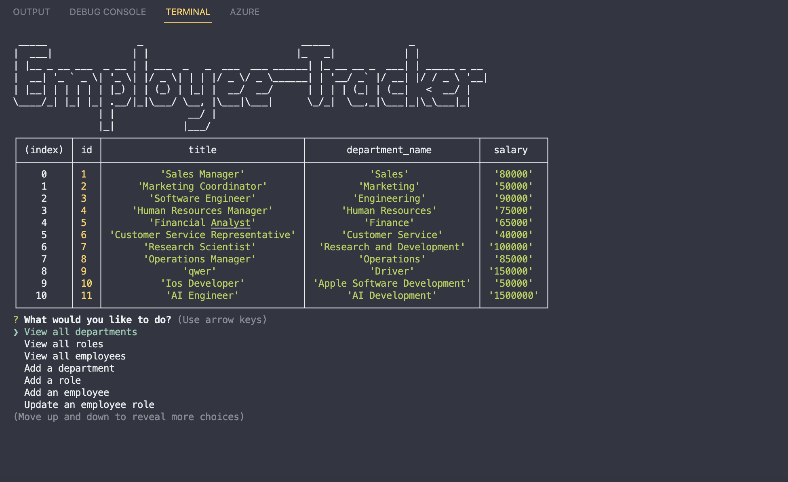
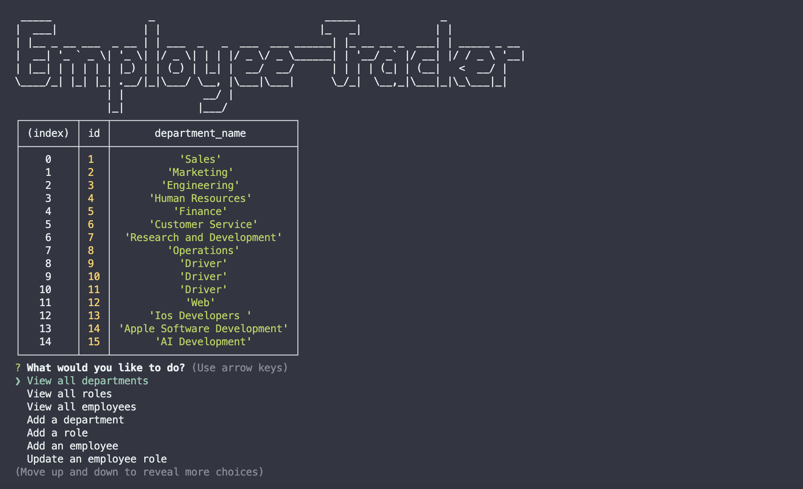
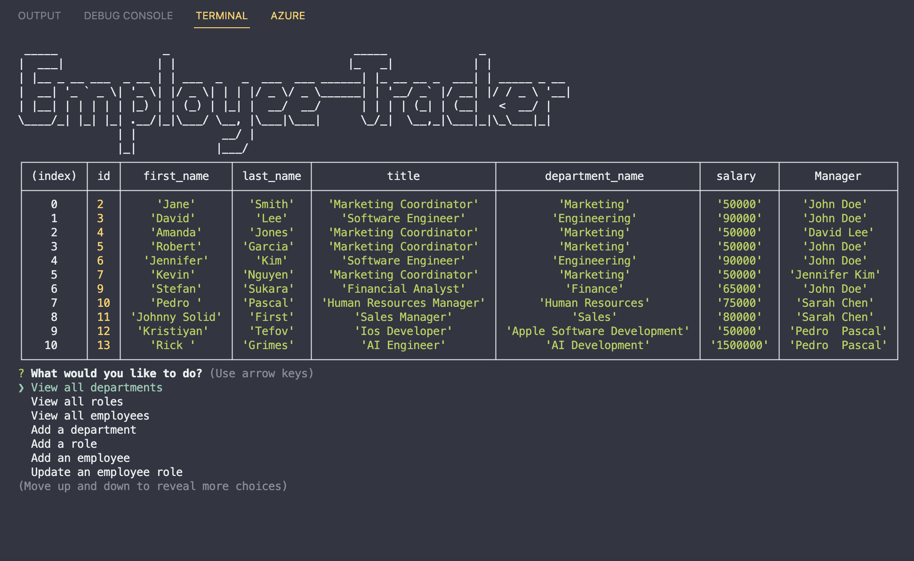

[](https://choosealicense.com/licenses/mit)     
# Employee-Tracker
## Table of Contents
* [License](#license)
* [Description](#description)
* [Installation](#installation)
* [Usage](#usage)
* [How to Contribute](#how-to-contribute)
* [Questions](#questions)
## License
 * This application is covered under: [MIT License](https://choosealicense.com/licenses/mit)
## Description
Employee Tracker is a command prompt program designed to help manage employees in an organization. With this program, you can easily view employee information based on various criteria such as department, roles, manager, and even add or update employees' information as needed.

The program offers a user-friendly interface that allows you to navigate through different options easily. When you start the program, you will be presented with a menu of options to choose from. The first option is to view employees by department. This allows you to see all the employees that work in a particular department, along with their job titles and other relevant information.

The second option is to view employees by roles. This option lets you see all employees in a particular role, such as managers, sales associates, or customer service representatives. You can also view employees by manager, which is useful if you want to see who reports to a particular manager or supervisor.

If you need to add new employees to the system, you can select the "Add Employee" option. This will prompt you to enter the employee's details such as name, job title, department. Once you've added a new employee, they will appear in the system, and you can view their information along with the other employees.

Finally, if you need to update an employee's information, you can select the "Update Employee" option. This will prompt you to choose the employee's name and then allow you to update any of their information such as their job title, department.

Overall, Employee-Tracker is a handy program that helps you keep track of your employees information and make it easy to access and update as needed. With its simple interface and multiple options, it is a valuable tool for any organization looking to manage their employees more efficiently.
## Installation
* You will need to run this command to install the application and dependencies.
```
npm install
```
* You will need to run this command to run the program.
```
npm start
```

## Usage
In order to use the program you will need to clone the repository from GitHub provided in the link below, run the npm commands in the installation section and navigate the CLI
## How to Contribute
For and suggestions or contributions you can reach me at my email address or you can clone to code and edit it the way it will suite you the best.

## Questions
* Reach me here on my GitHub account.

    [kristiyantefov](https://github.com/kristiyantefov) 

* Reach me on my email address for additional questions.

    kristiyan.tefov@icloud.com

## Link
Link to repository:

https://github.com/kristiyantefov/Employee-Tracker

Link to Video Tutorial:
* click on the image to open the video tutorial

[](https://drive.google.com/file/d/1noEFVuqH59mhlHy1OgXVJZpRSY2l_KG3/view?usp=sharing)


## Mock-Up







